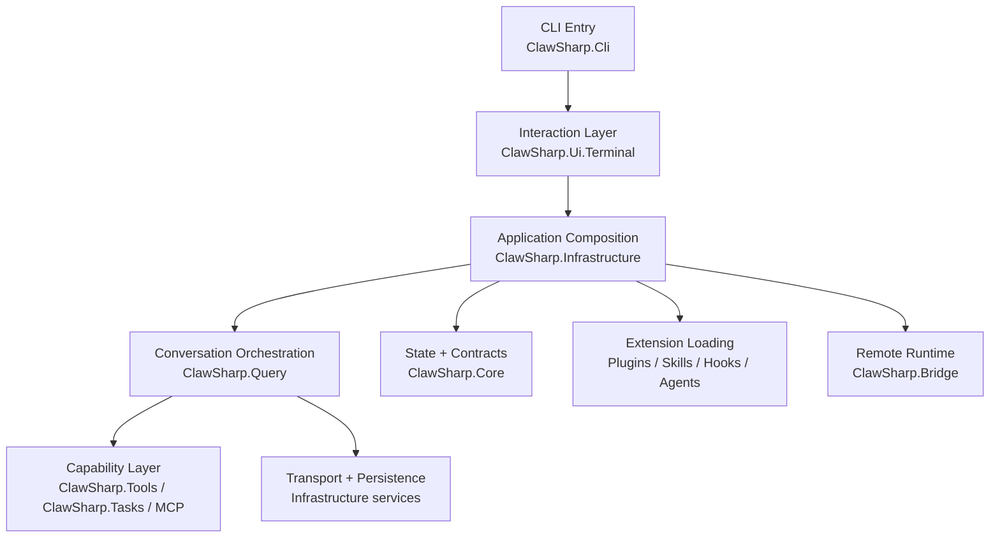
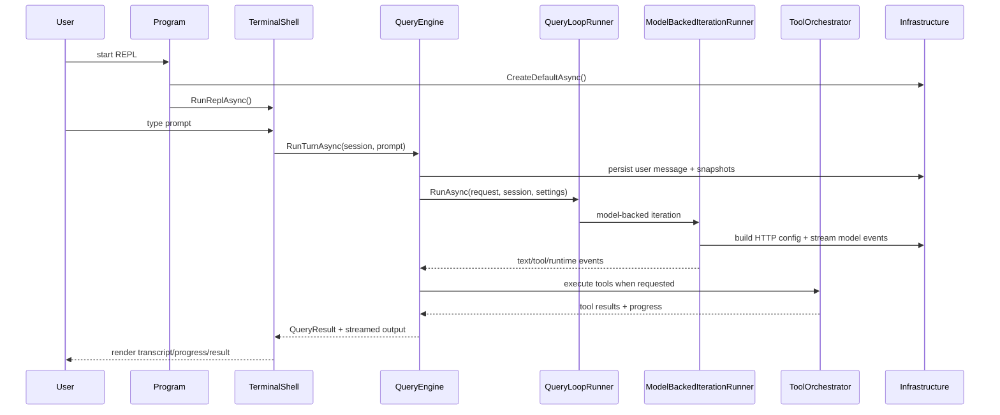

# ClawSharp Architecture Overview

This document is the C# rewrite equivalent of a high-level architecture overview. It follows the same spirit as the referenced Claude Code architecture page, but it is tailored to the current ClawSharp solution structure and runtime graph.

If you want the turn-by-turn console request path, see `user-chat-flow.md`.

## Architecture At A Glance

ClawSharp is organized as a layered terminal-native agent runtime. The layers are not strict microservices; they are project and runtime boundaries inside one process.

## The Five Main Layers

| Layer | Responsibility | Main Projects | Key Types |
| --- | --- | --- | --- |
| Interaction Layer | REPL loop, prompt input, transcript rendering, command routing | `ClawSharp.Cli`, `ClawSharp.Ui.Terminal` | `Program`, `TerminalShell`, `PromptInputReader` |
| Composition Layer | Builds the application object graph, loads settings/extensions, wires services | `ClawSharp.Infrastructure` | `ClawSharpApplicationFactory`, `ClawSharpApplication` |
| Orchestration Layer | Owns chat turns, session mutation, transcript persistence, query loop coordination | `ClawSharp.Query` | `QueryEngine`, `QueryLoopRunner`, `QueryTurnRequest` |
| Capability Layer | Executes tools, tasks, MCP-backed capabilities, stop hooks, progress updates | `ClawSharp.Tools`, `ClawSharp.Tasks`, parts of `ClawSharp.Infrastructure` | `ToolRegistry`, `ToolOrchestrator`, `TaskRegistry`, `McpLifecycleManager` |
| State + Infra Layer | Shared contracts, session models, settings, auth/persistence/transport helpers | `ClawSharp.Core`, `ClawSharp.Infrastructure`, `ClawSharp.Bridge` | `ConversationSession`, `ClawSharpSettings`, transcript/auth/bridge services |

This is the practical boundary model:

- `Core` defines nouns and contracts.
- `Infrastructure` wires and persists them.
- `Query` drives the runtime.
- `Tools` and `Tasks` are the action surface.
- `Ui.Terminal` exposes the runtime to the console.

## Solution Structure

The current solution is split into these top-level projects:

- `ClawSharp.Cli`
- `ClawSharp.Core`
- `ClawSharp.Extensions`
- `ClawSharp.Infrastructure`
- `ClawSharp.Query`
- `ClawSharp.Tasks`
- `ClawSharp.Tools`
- `ClawSharp.Ui.Terminal`
- `ClawSharp.Bridge`

What each project is for:

- `ClawSharp.Cli`: process entry point and REPL startup.
- `ClawSharp.Core`: shared records, enums, interfaces, session models, settings models, and app state contracts.
- `ClawSharp.Infrastructure`: assembly root for the runtime; settings bootstrap, transcript store, MCP lifecycle, extension loading, auth/persistence helpers, and app factory.
- `ClawSharp.Query`: the conversation engine, loop state machine, streaming model execution, retry logic, continuation logic, and result shaping.
- `ClawSharp.Tools`: concrete tool registry and file/history/tool execution primitives.
- `ClawSharp.Tasks`: background task registry and task lifecycle.
- `ClawSharp.Ui.Terminal`: terminal REPL shell and terminal-specific renderers.
- `ClawSharp.Bridge`: remote/bridge-oriented runtime pieces for code sessions and remote control surfaces.
- `ClawSharp.Extensions`: extension-facing types and integration seams.

## One Main Dataflow

The most important runtime path is a user typing a prompt into the console.

The detailed mechanics of this path are described in `user-chat-flow.md`. At the architecture level, the important point is that:

- the terminal never talks directly to the model transport
- `QueryEngine` is the boundary between UI and runtime
- the runtime is event-driven and incremental
- transcript persistence happens throughout the turn, not only at the end

## Layer Details

### 1. Interaction Layer

The interaction layer begins in `ClawSharp.Cli/Program.cs`.

Startup path:

1. create application graph with `ClawSharpApplicationFactory.CreateDefaultAsync()`
2. resolve or create a session through `ReplSessionBootstrapper`
3. hand control to `TerminalShell.RunReplAsync()`

`TerminalShell` is responsible for:

- replaying an existing session on resume
- reading prompt input
- routing slash commands to `CommandRegistry`
- routing normal prompts to `QueryEngine`
- rendering transcript messages, tool progress, tool results, and footer state

This layer should stay thin. It owns interaction flow, not model logic.

### 2. Composition Layer

`ClawSharpApplicationFactory` is the assembly root of the current runtime.

It wires:

- session factory and transcript store
- settings/bootstrap state
- app state store
- MCP services
- extension and agent bootstrap
- tool registry and task registry
- query engine and terminal shell

This is where the architecture becomes concrete. If you want to understand how a runtime object gets its collaborators, start here.

Important consequence:

- there is currently one central factory rather than a container-driven modular bootstrap
- most architectural edges are visible in one file, which is useful for parity work

### 3. Orchestration Layer

`QueryEngine` is the orchestration boundary between input and execution.

Its responsibilities include:

- creating the user `ChatMessage`
- mutating `ConversationSession`
- recording transcript entries
- creating file-history snapshots before changes
- starting the query loop
- consuming runtime events and shaping the final `QueryResult`

Under that, `QueryLoopRunner` coordinates one or more iterations. It delegates to:

- `ModelBackedIterationRunner` for model-driven conversation
- `ExplicitToolIterationRunner` for preselected tool execution

This is the C# rewrite’s equivalent of the “agentic loop” layer: it owns the turn state machine, continuation, termination reasons, and recovery branches.

### 4. Capability Layer

Capabilities are exposed through tools, tasks, hooks, and MCP integrations.

Main components:

- `ToolRegistry`: discovers and executes built-in/runtime tools
- `ToolOrchestrator`: batches and streams tool execution updates
- `TaskRegistry`: background tasks and queued task notifications
- `QueryStopHookRunner`: stop-hook interception in the runtime loop
- `McpLifecycleManager`: connection/cache lifecycle for MCP servers
- `McpToolRegistrationService` and `McpCommandResourceRegistrationService`: make MCP tools/resources visible to the runtime

This layer is where the model stops “thinking” and starts “doing”.

### 5. State + Infrastructure Layer

This layer holds durable state, contracts, auth, and transport.

Main examples:

- `ConversationSession`: in-memory session aggregate
- `JsonlTranscriptStore`: append-only transcript persistence
- `DefaultSessionFactory`: create/resume/continue sessions
- `EnvironmentQueryModelHttpClientConfigProvider`: base URL + auth injection
- `SecureStorageQueryAuthAccountStateProvider`: auth account state lookup
- `McpAuthStateService`: persisted MCP auth state
- `ClawSharp.Bridge`: remote session/bootstrap/bridge APIs

In practice, this layer hides the filesystem, secure storage, remote transport, and persistence formats from the orchestration layer.

## The Runtime Split: Query vs Tools vs Infrastructure

A useful mental model for the current codebase is:

- `Query` decides what should happen next.
- `Tools` performs capability work.
- `Infrastructure` tells the runtime how to reach the outside world and how to save state.

Examples:

- prompt shaping and continuation policy belong in `Query`
- file reads/writes and shell execution belong in `Tools`
- auth token lookup and transcript JSONL storage belong in `Infrastructure`

When a class starts mixing these responsibilities, it becomes hard to maintain parity and reason about failures.

## Extension Model

ClawSharp is not only a closed built-in tool runner. The composition layer also loads extension surfaces at startup.

Current extension/bootstrap axes:

- plugins via `ExtensionBootstrapper`
- skills via `ExtensionBootstrapper`
- hooks via `ExtensionBootstrapper`
- agents via `AgentBootstrapper`
- MCP servers via the MCP config/auth/lifecycle services

Important architectural trait:

- extensions are loaded into the same application graph rather than isolated plugin processes by default
- MCP is the main structured boundary for external tool/resource providers
- agents are configuration-driven definitions loaded from markdown frontmatter rather than hardcoded runtime classes only

## Persistence Model

The primary persistence mechanisms in the current architecture are:

- session transcript JSONL files
- file-history snapshots
- settings JSON
- secure storage for auth-related state
- MCP auth/discovery state

The transcript path convention is derived from the project path and session id. This keeps resume/continue behavior simple and filesystem-native.

Architecturally, ClawSharp favors:

- append-only or reconstructable state
- session-local history with resumability
- explicit stores rather than hidden global mutable state

## Communication And Model Transport

The model transport path in the current C# rewrite is built around streamed HTTP execution.

Key pieces:

- `QueryRequestBuilder`
- `QueryModelIterationRequestBuilder`
- `QueryModelHttpCallExecutor`
- `QueryModelSseStreamingClient`
- `QueryModelAnthropicStreamUpdateParser`

Important current implementation note:

- the transport is still Anthropic-shaped in the current rewrite
- `EnvironmentQueryModelHttpClientConfigProvider` reads `ANTHROPIC_BASE_URL`, `ANTHROPIC_API_KEY`, and OAuth-style token sources
- `RuntimeSettings.Model` still defaults to `foundation-placeholder` unless overridden

So the architecture is ready for a full provider pipeline, but the default runtime still exposes unfinished parity seams.

## Core Design Principles

### 1. Conversation State Is Explicit

`ConversationSession`, `QueryTurnRequest`, `QueryLoopState`, and `QueryResult` make the conversation lifecycle inspectable. The architecture prefers explicit records over hidden control flow.

### 2. Runtime Is Incremental

Model output, tool progress, and transcript persistence happen incrementally. The system does not wait for a whole turn to finish before surfacing useful state.

### 3. Capabilities Are Structured

Tools, MCP resources, hooks, tasks, and agents each have distinct runtime seams. This matters because execution, permissions, replay, and persistence differ by capability type.

### 4. Bootstrap Is Centralized

The current rewrite intentionally keeps assembly logic centralized in `ClawSharpApplicationFactory`. This makes parity work faster, at the cost of a larger composition root.

### 5. Persistence Is First-Class

Resume, continue, file history, queued task notifications, and tool results all rely on persisted state. Persistence is part of the main architecture, not a logging afterthought.

## Entry And Bootstrap Map

If you are new to the codebase, read in this order:

1. `ClawSharp/src/ClawSharp.Cli/Program.cs`
2. `ClawSharp/src/ClawSharp.Infrastructure/ClawSharpApplicationFactory.cs`
3. `ClawSharp/src/ClawSharp.Ui.Terminal/TerminalShell.cs`
4. `ClawSharp/src/ClawSharp.Query/QueryEngine.cs`
5. `ClawSharp/src/ClawSharp.Query/QueryLoopRunner.cs`
6. `ClawSharp/src/ClawSharp.Query/ModelBackedIterationRunner.cs`
7. `ClawSharp/src/ClawSharp.Query/ToolOrchestrator.cs`
8. `ClawSharp/src/ClawSharp.Infrastructure/JsonlTranscriptStore.cs`

That path gives you the minimum useful mental model of startup, interaction, orchestration, execution, and persistence.

## Current Rewrite Reality

This architecture is the architecture of the current C# runtime, not the final intended parity state.

Practical caveats:

- several classes explicitly mark themselves as partial parity ports
- the model transport/provider surface is not fully generalized yet
- some recovery, compaction, and advanced runtime branches are still intentionally incomplete
- the centralized factory is useful now, but it may eventually need decomposition once parity is stable

That said, the core architectural shape is already visible and consistent:

- terminal shell at the edge
- query engine at the center
- tools/tasks/MCP as the action surface
- infrastructure handling state, transport, and extension loading
