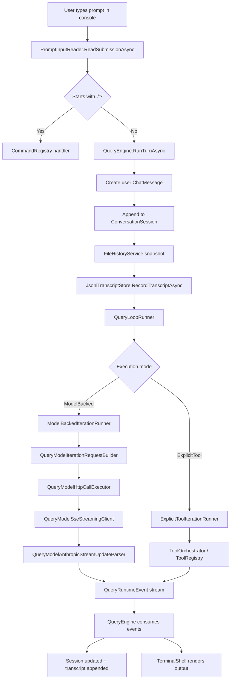

# ClawSharp Console Chat Flow

This note describes the current C# dataflow when a user types chat input into the ClawSharp console REPL. It is intended as a code-reading map for developers, not a product spec.

## Entry Point

The console starts in `ClawSharp/src/ClawSharp.Cli/Program.cs`.

High-level startup path:

1. `ClawSharpApplicationFactory.CreateDefaultAsync()` wires the app graph.
2. `ReplSessionBootstrapper.ResolveAsync(...)` decides whether to:
   - create a new session
   - continue the most recent session
   - resume a specific session
3. `TerminalShell.RunReplAsync(...)` owns the interactive loop.

Relevant files:

- `ClawSharp/src/ClawSharp.Cli/Program.cs`
- `ClawSharp/src/ClawSharp.Infrastructure/ClawSharpApplicationFactory.cs`
- `ClawSharp/src/ClawSharp.Infrastructure/ReplSessionBootstrapper.cs`
- `ClawSharp/src/ClawSharp.Core/DefaultSessionFactory.cs`

## End-to-End Flow

## REPL Loop Responsibilities

`TerminalShell.RunReplAsync(...)` is the main interactive controller.

It is responsible for:

- setting the active session in app state
- replaying existing transcript messages when resuming a session
- draining queued background task notifications before each prompt
- rendering the footer and prompt
- routing slash commands through `CommandRegistry`
- routing normal text input into `QueryEngine`
- rendering streamed tool progress, tool results, and assistant text

Important detail:

- multiline prompt input is handled by `PromptInputReader`
- a trailing `\` means “continue input on next line”
- `/exit` is handled directly in `TerminalShell`
- `/...` commands never go through the model path

Relevant files:

- `ClawSharp/src/ClawSharp.Ui.Terminal/TerminalShell.cs`
- `ClawSharp/src/ClawSharp.Ui.Terminal/PromptInputReader.cs`

## Session and Transcript Lifecycle

`ConversationSession` is the in-memory state container for the active chat thread.

It stores:

- session id
- project directory
- transcript path
- loaded messages
- file-history snapshot state
- optional custom title

Transcript persistence is append-only JSONL via `JsonlTranscriptStore`.

Current persistence behavior:

- user message is appended before the model/tool loop starts
- every emitted runtime `ChatMessage` is appended as soon as it is accepted by `QueryEngine`
- resumed sessions are reconstructed from the JSONL transcript on disk
- transcript path is under `~/.clawsharp/projects/<sanitized-project>/<session-id>.jsonl`

Relevant files:

- `ClawSharp/src/ClawSharp.Core/ConversationSession.cs`
- `ClawSharp/src/ClawSharp.Core/SessionStoragePaths.cs`
- `ClawSharp/src/ClawSharp.Infrastructure/JsonlTranscriptStore.cs`
- `ClawSharp/src/ClawSharp.Core/DefaultSessionFactory.cs`

## QueryEngine Boundary

`QueryEngine.RunTurnAsync(...)` is the key bridge between UI input and the query runtime.

For a normal user prompt it does the following:

1. drains queued task notifications
2. publishes a `QueryReceived` app event
3. converts the raw prompt into a user `ChatMessage`
4. appends that message to `ConversationSession`
5. makes a file-history snapshot for the user message
6. persists the updated transcript
7. builds an initial `QueryModelRequest` snapshot for bookkeeping/result shaping
8. starts the runtime loop by calling `IQueryTurnRunner.RunAsync(...)`
9. consumes runtime events and updates the session/transcript incrementally
10. returns a `QueryResult` back to `TerminalShell`

Runtime events that matter most here:

- `QueryMessageRuntimeEvent`
- `QueryStreamDeltaRuntimeEvent`
- `QueryLoopTransitionRuntimeEvent`
- `QueryLoopTerminalRuntimeEvent`

`QueryEngine` is also the place where partial failures are normalized into transcript-safe recovery messages, such as missing tool results after an interrupted tool run.

Relevant files:

- `ClawSharp/src/ClawSharp.Query/QueryEngine.cs`
- `ClawSharp/src/ClawSharp.Query/QueryResult.cs`
- `ClawSharp/src/ClawSharp.Query/QueryTurnRequest.cs`

## Outer Query Loop

`QueryLoopRunner` is the outer coordinator around one or more iterations.

It:

- creates the initial `QueryLoopState`
- emits `QueryRequestStartRuntimeEvent`
- runs the selected iteration runner
- handles continuation transitions
- stops on a terminal reason

Runner selection happens in `DispatchingQueryIterationRunner`:

- `ModelBacked` requests go to `ModelBackedIterationRunner`
- `ExplicitTool` requests go to `ExplicitToolIterationRunner`
- `Auto` switches based on whether requested tools are already present

Relevant files:

- `ClawSharp/src/ClawSharp.Query/QueryLoopRunner.cs`
- `ClawSharp/src/ClawSharp.Query/DispatchingQueryIterationRunner.cs`
- `ClawSharp/src/ClawSharp.Query/ExplicitToolTurnRunner.cs`

## Model-Backed Chat Path

For normal chat, `QueryTurnRequest.Create(...)` currently sets `ExecutionMode = ModelBacked`, so the request flows into `ModelBackedIterationRunner`.

That path is:

1. `QueryModelIterationRequestBuilder.Build(...)`
2. `QueryRequestBuilder.BuildFromMessages(...)`
3. `QueryModelHttpCallExecutor.StreamAsync(...)`
4. `QueryModelSseStreamingClient.StreamAsync(...)`
5. `QueryModelAnthropicStreamUpdateParser.Parse(...)`
6. runtime events flow back into `QueryEngine`

What each layer does:

- `QueryRequestBuilder` converts session messages into provider request messages, system prompt blocks, tool schemas, and output config
- `EnvironmentQueryModelHttpClientConfigProvider` injects base URL, transport kind, and auth config
- `QueryModelHttpCallExecutor` handles retry, overload, fallback, and auth-recovery hooks
- `QueryModelAnthropicStreamUpdateParser` consumes the normalized stream events and turns SSE payloads into:
  - text deltas
  - assistant text messages
  - assistant tool-use messages
  - assistant API-error messages

Important current implementation detail:

- the runtime now has a provider-aware transport boundary
- request transport currently supports:
  - Anthropic messages
  - OpenAI-compatible chat completions
  - Codex responses
- provider selection can come from:
  - `agentModels`
  - `agentRouting`
  - `CLAUDE_CODE_USE_*` provider flags
  - CLI `--provider` and `--model`
  - REPL `/provider`
- the high-level stream parser is still Anthropic-shaped, so non-Anthropic transports are normalized into Anthropic-style stream events before parsing
- `RuntimeSettings.Model` still defaults to `foundation-placeholder`, but runtime resolution now substitutes provider defaults such as Anthropic, OpenAI, Gemini, GitHub Models, or Codex defaults

Relevant files:

- `ClawSharp/src/ClawSharp.Query/ModelBackedIterationRunner.cs`
- `ClawSharp/src/ClawSharp.Query/QueryModelIterationRequestBuilder.cs`
- `ClawSharp/src/ClawSharp.Query/QueryRequestBuilder.cs`
- `ClawSharp/src/ClawSharp.Query/QueryModelHttpCallExecutor.cs`
- `ClawSharp/src/ClawSharp.Query/QueryModelAnthropicStreamUpdateParser.cs`
- `ClawSharp/src/ClawSharp.Query/QueryModelHttpRequestFactory.cs`
- `ClawSharp/src/ClawSharp.Query/QueryModelSseStreamingClient.cs`
- `ClawSharp/src/ClawSharp.Infrastructure/EnvironmentQueryModelHttpClientConfigProvider.cs`
- `ClawSharp/src/ClawSharp.Core/ProviderRuntimeResolver.cs`
- `ClawSharp/src/ClawSharp.Core/RuntimeSettings.cs`

## Tool Execution Path

When the runtime reaches explicit tool execution, the flow shifts to:

1. `ExplicitToolIterationRunner`
2. `ToolOrchestrator`
3. `ToolRegistry.ExecuteAsync(...)`
4. tool progress and tool result messages are emitted back into the runtime event stream

The tool path emits structured chat messages, not just side effects:

- assistant `tool_use`
- progress messages
- user `tool_result`
- optional assistant continuation/final text

Those messages are persisted through the same `QueryEngine` transcript path as normal assistant text.

Relevant files:

- `ClawSharp/src/ClawSharp.Query/ExplicitToolIterationRunner.cs`
- `ClawSharp/src/ClawSharp.Query/ToolOrchestrator.cs`

## What The Terminal Actually Renders

`TerminalShell` does not render raw SSE events directly.

Instead:

- text deltas are accumulated into a local `StringBuilder`
- tool progress messages are passed through `ToolProgressMessageRenderer`
- tool result messages are passed through `ToolResultMessageRenderer`
- completed transcript messages are rendered through `TranscriptMessageRenderer`

This means there are two parallel views of the same turn:

- transcript-safe `ChatMessage` objects stored in the session
- terminal-specific rendering state for interactive output

## Debugging Checklist

When a console chat “does nothing” or behaves unexpectedly, inspect the flow in this order:

1. Did `Program` actually enter REPL mode?
2. Did `PromptInputReader` return a prompt submission or a slash command?
3. Did `QueryEngine` append and persist the user message?
4. Did `QueryLoopRunner` emit `QueryRequestStartRuntimeEvent`?
5. Which iteration runner was selected?
6. If model-backed, what request model/base URL/auth config was built?
7. Did `QueryModelAnthropicStreamUpdateParser` emit text, tool use, or API error messages?
8. Did `TerminalShell` render tool-result-only output and skip the plain assistant render path?

## Current Gaps To Keep In Mind

This document reflects the current implementation, not the intended final parity state.

Known limitations visible in this path:

- the C# rewrite is still marked as partial parity in several classes
- model transport remains Anthropic-oriented
- some recursive recovery and compaction branches are intentionally unported
- bash input mode is acknowledged in the REPL but not implemented
- the default runtime model is still `foundation-placeholder`
